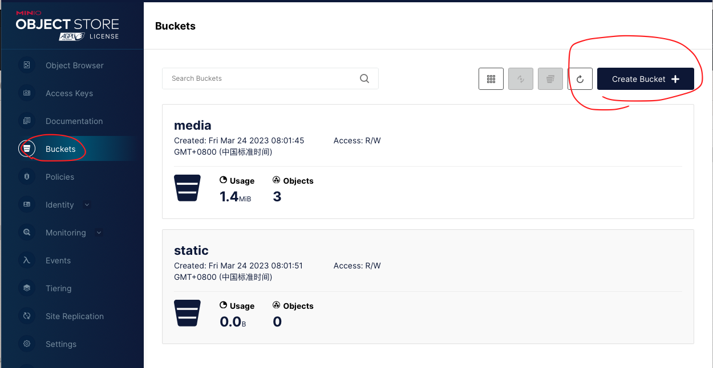

# 野火Minio

野火Minio是基于最流行的开源对象存储服务[Minio](https://github.com/minio/minio)进行二次开发的，二次开发的内容仅涉及到与野火IM的对接。因此野火Minio可以按照原生Minio的使用和运维。但也有一些细微细节不同。首次部署需要进行配置，以后可以正常启动就行。***野火Minio依赖于专业版，适合对安全性能要求很高的私有化部署，社区版不支持。***

## 运行方式
1. 上传：客户端需要上传时，先调用IM服务获取上传的token，IM服务根据配置里的信息计算出一个token（不需要与OSS进行调用）返回给客户端，客户端用自己的私钥把数据加密后用IM服务返回的token上传。OSS收到请求后验证token，验证通过后，在去通过IM服务的API获取用户的私钥进行解密保存文件。
2. 下载：客户端直接请求OSS服务。如果bucket禁止非授权访问，客户端可以调用getAuthorizedMediaUrl方法来获取经过授权的URI进行访问，这个如上传一样，由服务器端计算出授权。一般建议头像和动态表情运行非授权访问，其它重要文件可以配置成授权访问。

综上OSS服务需要能够获取到用户的密钥，用来解密客户端加密的信息。获取用户密钥是通过server api进行，也可以选择直接读取IM服务数据库。

## 环境要求
OSS服务需要独立的公网IP。客户端上传下载都是与OSS服务进行直接连接，不经过IM服务器，如果想要好的体验，需要保证一定的带宽。OSS服务如果通过server api与im服务交互，需要确保服务的连通性，如果通过访问IM数据库的方式，需要确保能够读取IM数据库，可以限制除了需要的端口以外的所有出访。OSS服务需要限制除80以外的所有入访。

## 升级方法
如果已经部署需要按照升级步骤进行。升级方法：
1. 停掉minio服务。
2. 备份```~/.minio```和```${minio_data_path}/.minio.sys```目录。备份旧的程序文件。
3. 然后删除上述两个目录。注意minio数据目录其它文件夹一定要保留，防止丢失数据。
4. 按照下面首次部署方法进行部署。注意部署成功后需要再次设置Policy。
5. 如果部署失败，恢复旧的程序文件和步骤2的两个文件夹。

## 首次部署

#### 1.启动野火IM服务
启动野火IM服务，创建数据库，后面Minio需要用到野火IM的数据库

#### 2.启动野火Minio服务
```sh
## minio-data 为数据目录，需要运行前创建好，且具有读写权限。
minio  server /minio-data
```
运行成功后会有如下的提示
```
Endpoint:  http://10.255.20.59  http://127.0.0.1

Browser Access:
   http://10.255.20.59  http://127.0.0.1

Object API (Amazon S3 compatible):
   Go:         https://docs.min.io/docs/golang-client-quickstart-guide
   Java:       https://docs.min.io/docs/java-client-quickstart-guide
   Python:     https://docs.min.io/docs/python-client-quickstart-guide
   JavaScript: https://docs.min.io/docs/javascript-client-quickstart-guide
   .NET:       https://docs.min.io/docs/dotnet-client-quickstart-guide

```
> 如果没有可执行权限，使用```chmod a+x minio```来添加可执行权限。由于需要用到80端口，在linux机器上使用root权限，使用```root```用户或者```sudo```命令来运行。可能会提醒密码简单需要修改初始密码。

#### 3. 解压mc目录下的```mc```工具。增加可执行权限，然后执行下面语句为Minio服务设置别名
```shell script
./mc config host add myminio http://47.52.118.96 minioadmin minioadmin
```
> 不需要在Minio服务所在的机器上运行，可以远程。另外```myminio```是服务的别名，可以任意起名，后面需要用到，如果在一台电脑操作多个minio服务，注意别名不要重复

> 最后两个参数为AK/SK，需要使用正确的值，第二步启动的控制台日志中会有。

#### 4. 更新Minio的野火IM配置
OSS服务有两种方法获取用户的密钥用来加密，一种是通过server api，在2020.7.29号之后的专业版本都支持，建议用这种方法：
```
./mc admin config set myminio WFChat IMAdminUrl=http://${im_server_address}:18080/admin/minio/sk IMAdminSecret=${im_server_admin_secret}
```
> IMAdminUrl是server api地址，需要确保minio服务与IM服务管理端口的连通性。18080是默认的管理端口，如果修改过这里也需要对于修改。IMAdminSecret为server api的密钥。


如果IM服务是2020.7.29号之前，只能支持读取IM服务的数据库获取用户secret，而且数据库只能用mysql，别的数据库都不支持。请使用下面配置
```shell script
./mc admin config set myminio WFChat DefaultSecret=00,11,22,33,44,55,66,77,78,79,7A,7B,7C,7D,7E,7F MySQLAddr=192.168.1.100:3306 MySQLDB=wfchat MySQLUserName=root MySQLPassword=123456
```
> ```DefaultSecret```需要配置IM服务参数```client.proto.secret_key```相同的值，必须保存默认不变。

> MySQL的地址正确配置就行。注意与野火IM MySQL配置的格式不通，保持当前这种格式。正确配置mysql的地址，数据库名称，用户名和密码。

如果IM服务使用国密加密，需要执行下面操作开启国密加密。注意只有特殊客户才配置此项，普通客户请忽略此配置。
```
./mc admin config set myminio WFChat SM4Encrypt=on
```
> 如果要关闭，on改成off就可以了

#### 5. 重启野火Minio服务
重启服务，好让设置生效，必须重启才行。使用如下命令重启
```
./mc admin service restart myminio
```

#### 6. 新建bucket
用浏览器打开```http://47.52.118.96```（这里作为示例，实际使用时请换成客户服务的外网IP），如果是升级部署可以看见之前存在的bucket，内部数据都存在，不用再创建bucket，如果是首次部署则为空。点右下角的```+```，选择创建bucket，创建2个bucket，如下图所示：


设置权限,点击bucket右侧的菜单按钮，选择```Edit policy```，弹出如下图界面，选择```Add```添加如下，注意升级部署也需要再次设置


#### 7. 配置野火IM
野火IM的配置请参考专业版野火IM部署说明，更改完配置后重启。
```
##存储使用类型，0使用内置文件服务器（仅供用于研发测试），1使用七牛云存储，2使用阿里云对象存储，3野火私有对象存储
##除了内置文件服务器外，其他对象存储服务需要设置上传需要鉴权，下载不需要鉴权模式。
##这里改成3
media.server.media_type 3

## minio服务地址，要求是域名或者公网IP，不用加http头
media.server_url  47.52.118.96
## 如果是非80端口，需要在这里配置，不能写到server_url中去，另外下面media.bucket_XXXX_domain的地址也要加上端口。
media.server_port 80
media.server_ssl_port 443
## AK/SK minio服务启动时会打印出来AK/SK，默认是minioadmin，需求修改复杂字符串。
media.access_key minioadmin
media.secret_key minioadmin

## bucket名字
media.bucket_general_name media
## domain为minio服务器地址/bucket名字,不是服务器地址/minio/bucket名字。如果非80端口还要加上端口号。
media.bucket_general_domain http://47.52.118.96/media
media.bucket_image_name media
media.bucket_image_domain http://47.52.118.96/media
media.bucket_voice_name media
media.bucket_voice_domain http://47.52.118.96/media
media.bucket_video_name media
media.bucket_video_domain http://47.52.118.96/media
media.bucket_file_name media
media.bucket_file_domain http://47.52.118.96/media
media.bucket_sticker_name media
media.bucket_sticker_domain http://47.52.118.96/media
media.bucket_moments_name media
media.bucket_moments_domain http://47.52.118.96/media
media.bucket_portrait_name storage
media.bucket_portrait_domain http://47.52.118.96/storage
media.bucket_favorite_name storage
media.bucket_favorite_domain http://47.52.118.96/storage
```
> 上述参数为示例参数，请替换为客户对应的参数。

> bucket media/storage为示例，客户实际使用时可以使用不同的名称。但至少要创建2个用来存储长期保存和短期保存的媒体文件，建议为上述7类每类创建一个bucket。

> 上传必须支持http上传（我们已经加密过了），因此```media.server_url```必须是http的，media.bucket_XXXX_domain可以增加https的支持。


#### 8. 验证上传下载是否正常。
验证上传下载是否正常。

## 进阶配置
#### 1. 使用域名
配置域名解析到minio服务器，然后IM服务配置文件中的IP替换成域名。这样如果以后迁移存储服务也不会有问题。

#### 2. 集群部署
只有部署集群后，才可以提供高可用，当少于一半的存储磁盘损坏也不会丢失数据。具体部署方法请自行查找Minio官方文档。

#### 3. 配置https
上传必须是http，http method是```put```。可以下载配置为https。首先用如下命令启动，更换minio服务的端口为9000
```
./minio server --address 47.52.118.96:9000 /minio-data
```
然后配置nginx，反向代理到80端口，配置证书，使其能够同时支持HTTP/HTTPS双栈，注意转发时要把```http header```都带上。

最后就是修改配置文件```media.server_url```保持不变，```media.bucket_XXXX_domain```改为https对应地址。

#### 4. 配置CDN加速
如果客户比较多，且全国甚至全世界分别比较广，使用dns能够提高下载速度，提高用户体验。可以对下载进行dns加速，然后正确配置```media.bucket_XXXX_domain```。

## 常见问题
#### 1. 使用nginx反向代理后，不能发送大文件
这是因为nginx默认不能发送大文件，请把最大文件限制改为2G，最大超时时间改为60分钟。如下所示：
```
#上传文件大小限制
client_max_body_size 2048M;

#设置为on表示启动高效传输文件的模式
sendfile on;

#保持连接的时间，默认65s
keepalive_timeout 3600;
```
#### 2. 上传文件失败，minio服务抛出异常
检查日志异常调用栈中是否有```wfchat.getUserSecret```字段。如果有则说明是minio调用im服务获取用户密钥失败，检查minio服务是否可以访问im服务的管理端口（默认是18080），管理密钥是否正确等。

#### 3. 使用nginx反向没有转发header
header中带有用户id信息，这样minio可以查找到对应用户id的密钥，用来解密上传的内容。请确保转发时带上所有header，下面为参考配置 ：
```
location / {
        proxy_set_header  Host  $http_host;
        proxy_set_header  X-real-ip $remote_addr;
        proxy_set_header  X-Forwarded-For $proxy_add_x_forwarded_for;
        proxy_pass  http://minio_cluster;
}
```

#### 4. 不要修改minio的region
IM服务内默认使用的region是```us-east-1 ```，是默认的minio的region，请使用这个默认的region，不能修改为其他值。这个值实际使用上没有其他的意义。

## 鸣谢
感谢[Minio](https://github.com/minio/minio)提供如此棒的开源产品
