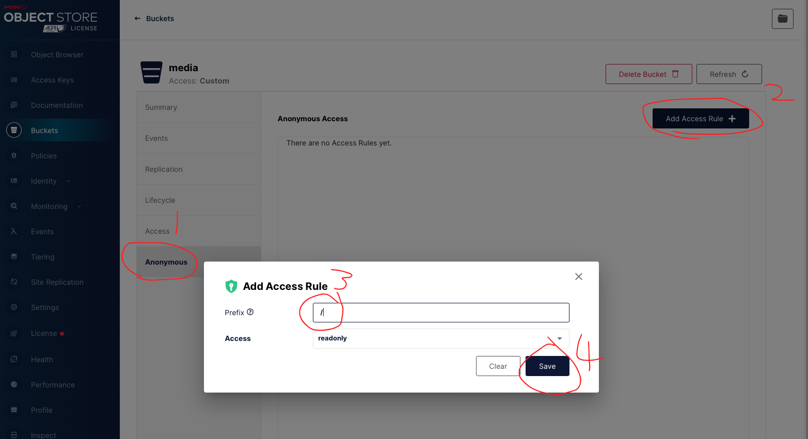

# 野火Minio

野火Minio是基于最流行的开源对象存储服务[Minio](https://github.com/minio/minio)进行二次开发的，二次开发的内容仅涉及到与野火IM的对接。因此野火Minio可以按照原生Minio的使用和运维。但也有一些细微细节不同。首次部署需要进行配置，以后可以正常启动就行。***野火Minio依赖于专业版，适合对安全性能要求很高的私有化部署，社区版不支持。***

## 配置方法

#### 1.启动野火IM服务
启动野火IM服务，创建数据库，后面Minio需要用到野火IM的数据库

#### 2.启动野火Minio服务
```sh
minio  server /minio-data
```
运行成功后会有如下的提示
```
Endpoint:  http://192.168.1.101  http://127.0.0.1            
AccessKey: 0M7YVO70QPKBPWBZW5FW
SecretKey: ZrBsSST++1Qjap+Nfs3P2BujHCHDuqrsrYi0zNn8

Browser Access:
   http://192.168.1.101  http://127.0.0.1            

Command-line Access: https://docs.min.io/docs/minio-client-quickstart-guide
   $ mc config host add myminio http://192.168.1.101 0M7YVO70QPKBPWBZW5FW ZrBsSST++1Qjap+Nfs3P2BujHCHDuqrsrYi0zNn8

Object API (Amazon S3 compatible):
   Go:         https://docs.min.io/docs/golang-client-quickstart-guide
   Java:       https://docs.min.io/docs/java-client-quickstart-guide
   Python:     https://docs.min.io/docs/python-client-quickstart-guide
   JavaScript: https://docs.min.io/docs/javascript-client-quickstart-guide
   .NET:       https://docs.min.io/docs/dotnet-client-quickstart-guide

```
> 如果没有可执行权限，使用```chmod a+x minio```来添加可执行权限。由于需要用到80端口，在linux机器上使用root权限，使用```root```用户或者```sudo```命令来运行.

#### 3. 安装[mc](https://docs.min.io/docs/minio-client-quickstart-guide)工具。安装完成后，执行下面语句为Minio服务设置别名
```shell script
mc config host add myminio http://192.168.1.101 0M7YVO70QPKBPWBZW5FW ZrBsSST++1Qjap+Nfs3P2BujHCHDuqrsrYi0zNn8
```
> 不需要在Minio服务所在的机器上运行，可以远程。另外```myminio```是服务的别名，可以任意起名，后面需要用到，如果在一台电脑操作多个minio服务，注意别名不要重复

#### 4. 获取Minio的配置
```shell script
mc admin config get myminio/ > myconfig
```
> 如果出现错误，请确认当前客户端是否跟Minio能够连通，Minio服务是否正常运行。

#### 5. 更改Minio的配置如下
```text
 "WFChat": {
  "DefaultSecret": "00,11,22,33,44,55,66,77,78,79,7A,7B,7C,7D,7E,7F",
  "MySQLAddr": "192.168.1.199:3306",
  "MySQLDB": "wfchat",
  "MySQLPassword": "123456",
  "MySQLUserName": "root"
 },
```
> ```DefaultSecret```需要配置IM服务参数```client.proto.secret_key```相同的值，可以保存默认不变，如果改动这里需要使用16进制，并把```0X```去掉。
> MySQL的地址正确配置就行。注意与野火IM MySQL配置的格式不通，保持当前这种格式。

执行下面语句，更新配置
```text
mc admin config set myminio/ < myconfig
```
#### 6. 重启野火Minio服务
重启服务，好让设置生效，必须重启才行。

#### 7. 新建bucket
用浏览器打开```http://192.168.1.101```（这里作为示例，实际使用时请换成客户服务的外网IP），然后点右下角的```+```，选择创建bucket。然后分别创建3个bucket，如下图所示：


设置权限,点击bucket右侧的菜单按钮，选择```Edit policy```，弹出如下图界面，选择```Add```添加



#### 8. 配置野火IM
野火IM的配置请参考专业版野火IM部署说明，更改完配置后重启。
```
media.server_url  http://192.168.1.101
media.access_key 0M7YVO70QPKBPWBZW5FW
media.secret_key ZrBsSST++1Qjap+Nfs3P2BujHCHDuqrsrYi0zNn8

## bucket名字及Domain
media.bucket_general_name media
media.bucket_general_domain http://192.168.1.101/media
media.bucket_image_name media
media.bucket_image_domain http://192.168.1.101/media
media.bucket_voice_name media
media.bucket_voice_domain http://192.168.1.101/media
media.bucket_video_name media
media.bucket_video_domain http://192.168.1.101/media
media.bucket_file_name media
media.bucket_file_domain http://192.168.1.101/media
media.bucket_portrait_name storage
media.bucket_portrait_domain http://192.168.1.101/media
media.bucket_favorite_name storage
media.bucket_favorite_domain http://192.168.1.101/media
```
> 上述参数为示例参数，请替换为客户对应的参数。
> bucket media/storage为示例，客户实际使用时可以使用不同的名称。
> 上传必须支持http上传（我们已经加密过了），因此```media.server_url```必须是http的，media.bucket_XXXX_domain可以增加https的支持。

#### 9. 验证上传下载是否正常。
验证上传下载是否正常。

## 鸣谢
感谢[Minio](https://github.com/minio/minio)提供如此棒的开源产品
